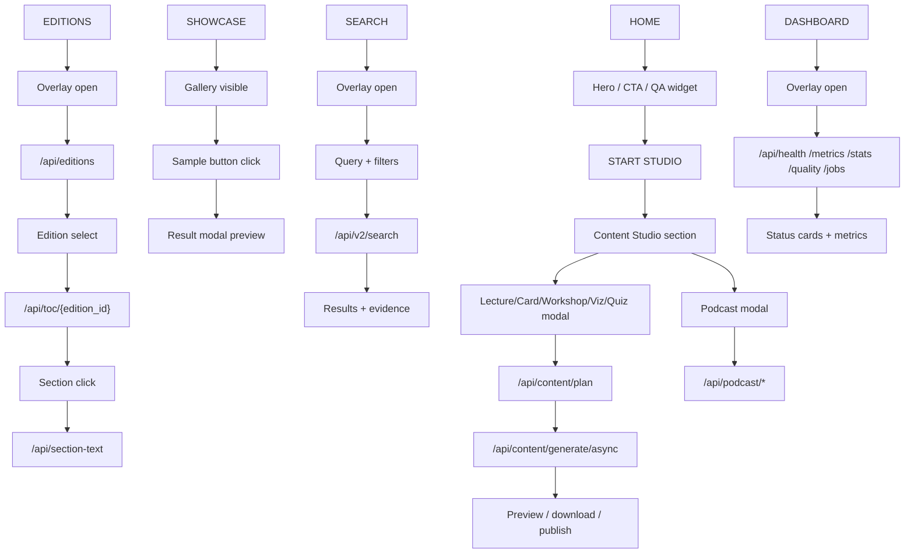

# Frontend Tab Validation

Date: 2026-03-16 (Asia/Seoul)

Frontend:
- Production: https://skmsai.netlify.app
- Deploy: https://69b761c9c0ed48158f7a39c6--skmsai.netlify.app

Backend:
- API: https://skmsai-api.onrender.com

Method:
- Live browser verification with Playwright against the production Netlify URL.
- Direct HTTP checks against the production Render API.
- Source of truth for the deployed frontend: `public/index.html`.

## Tab Flow

## Live Checklist

| Area | Expected user-visible behavior | Live result | Notes |
| --- | --- | --- | --- |
| HOME | Landing page renders and nav is clickable | PASS | Hero and nav loaded normally on the production site. |
| SHOWCASE tab | `SHOWCASE` reveals gallery section | PASS | Verified in live browser. |
| SHOWCASE sample | Sample button opens result modal | PASS | First showcase sample opened the studio result modal. |
| EDITIONS tab shell | `EDITIONS` opens overlay | PASS | Overlay opens on click. |
| EDITIONS data | Edition list should populate | FAIL | After 12s the UI still showed `판본 정보를 불러오는 중...`. Direct API calls timed out. |
| SEARCH tab shell | `SEARCH` opens overlay | PASS | Overlay opens on click. |
| SEARCH data | Query should return results | FAIL | After 12s the UI still showed `검색 중...`. Direct API calls timed out. |
| DASHBOARD tab shell | `DASHBOARD` opens overlay | PASS | Overlay opens on click. |
| DASHBOARD data | Metrics/status cards should fill in | FAIL | After 12s the metric stayed `--` and status stayed `--`. Direct API calls timed out. |
| START STUDIO nav | `START STUDIO` scrolls to studio section | PASS | Verified in live browser. |
| Lecture modal | Lecture card opens studio modal | PASS | Verified in live browser. |
| Lecture plan generation | Plan preview should return plan data | FAIL | Current live backend did not respond within timeout. Earlier live check also exposed insufficient Anthropic credit on plan generation before the later backend-wide timeout state. |
| Podcast modal | Podcast card opens dedicated podcast modal | PASS | Verified in live browser. |
| Podcast generation | Audio/video generation pipeline | NOT RUN | Omitted from live execution because it triggers a long-running asset generation job. |

## Findings

- The original live frontend was blocked by multiple frontend runtime issues in `public/index.html`: broken top-level `await`, duplicated `const chatWindow`, missing DOM guards, and duplicate card listeners.
- Those frontend issues were repaired and redeployed on 2026-03-16. After deployment, the live tab shells and modal interactions recovered.
- The remaining production blocker is backend responsiveness on Render. During live verification on 2026-03-16, `health`, `editions`, `search`, `dashboard metrics`, and `content plan` all timed out from direct HTTP checks.
- Because of that backend state, the UI now opens correctly but data-backed tabs remain stuck in loading states.

## Files Added For Reuse

- `scripts/verify_live_frontend.py`: reusable live smoke test script for future tab checks.
